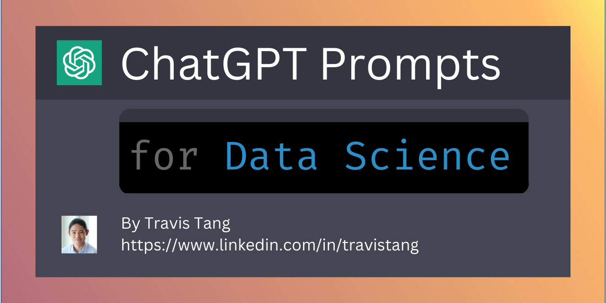

<h1> 🚀 ChatGPT Promptsfor Data Science Repository!</h1>

The [ChatGPT](https://chat.openai.com/chat) model is a large language model trained by [OpenAI](https://openai.com) that is capable of generating human-like text. By providing it with a prompt, it can generate responses that continue the conversation or expand on the given prompt.

In this repository, you will find prompts that can be used with ChatGPT for data science purposes. It is curated by [Travis Tang](https://www.linkedin.com/in/travistang).

To get started, simply use the prompts below as input for ChatGPT. Replace everything in `[squarebrackets]` with your own to achieve results specific to your use case.

You can also view the collated prompts (including screenshots of ChatGPT's response) as a [PDF here](chatgpt-datascience-prompt.pdf) 

Adapted from the [Awesome ChatGPT repo](https://github.com/f/awesome-chatgpt-prompts) for Data Science.

---
# Table of Contents:
1. [Write python](#write-python)
2. [Explain code](#explain-code)
3. [Optimize code](#optimize-code)
4. [Format code](#format-code)
5. [Translate code from one language to another](#translate-code)
6. [Explain concepts](#explain-concepts)
7. [Suggest ideas](#suggest-ideas)
8. [Troubleshoot problem](#troubleshoot-problem)
9. [Write SQL](#write-sql)
10. [Write other Code](#write-other-code)
11. [Misc](#misc)

---
# WRITE PYTHON
## 1. Train Classification Model
> Prompt: I want you to act as a data scientist and code for me. I have a dataset of `[describe dataset]`. Please build a machine learning model that predict `[target variable]`. 

## 2. Automatic Machine Learning
> Prompt: I want you to act as an automatic machine learning (AutoML) bot using TPOT for me. I am working on a model that predicts `[...]`. Please write python code to find the best classification model with the highest AUC score on the test set.

## 3. Tune Hyperparameter
> Prompt: I want you to act as a data scientist and code for me. I have trained a `[model name]`. Please write the code to tune the hyper parameters.

## 4. Explore Data
> Prompt: I want you to act as a data scientist and code for me. I have a dataset of `[describe dataset]`. Please write code for data visualisation and exploration.

## 5. Generate Data
> Prompt: I want you to act as a fake data generator. I need a dataset that has x rows and y columns: `[insert column names]`

## 6. Write Regex
> Prompt: I want you to act as a coder. Please write me a regex in python that `[describe regex]`

## 7. Train Time Series
> Prompt: I want you to act as a data scientist and code for me. I have a time series dataset `[describe dataset]`. Please build a machine learning model that predict `[target variable]`. Please use `[time range]` as train and `[time range]` as validation.

## 8. Address Imbalance Data
> Prompt: I want you to act as a coder. I have trained a machine learning model on an imbalanced dataset. The predictor variable is the column `[Insert column name]`. In python, how do I oversample and/or undersample my data?

## 9. Get Feature Importance
> Prompt: I want you to act as a data scientist and explain the model's results. I have trained a decision tree model and I would like to find the most important features. Please write the code. 

## 10. Visualize Data with Matplotlib
> Prompt: I want you to act as a coder in python. I have a dataset `[name]` with columns `[name]`. `[Describe graph requirements]`

## 11. Visualize Image Grid Matplotlib
> Prompt: I want you to act as a coder. I have a folder of images. `[Describe how files are organised in directory]` `[Describe how you want images to be printed]`

## 12. Explain Model with Lime
> Prompt: I want you to act as a data scientist and explain the model's results. I have trained a `[library name]` model and I would like to explain the output using LIME. Please write the code. 

## 13. Explain Model with Shap
> Prompt: I want you to act as a data scientist and explain the model's results. I have trained a scikit-learn XGBoost model and I would like to explain the output using a series of plots with Shap. Please write the code. 

## 14. Write Multithreaded Functions
> Prompt: I want you to act as a coder. Can you help me parallelize this code across threads in python?

## 15. Compare Function Speed
> Prompt: I want you to act as a software developer. I would like to compare the efficiency of two algorithms that performs the same thing in python. Please write code that helps me run an experiment that can be repeated for 5 times. Please output the runtime and other summary statistics of the experiment. `[Insert functions]`

## 16. Create NumPy Array
> Prompt: I want you to act as a data scientist. I need to create a numpy array. This numpy array should have the shape of (x,y,z). Please initialize the numpy array with random values.

## 17. Write Unit Test
Credit: [@svpino](https://twitter.com/svpino)
> Prompt: I want you to act as a software developer. Please write unit tests for the function `[Insert function]`. The test cases are: `[Insert test cases]`

## 18. Validate Column
> Prompt: I want you to act as a data scientist. Please write code to test if that my pandas Dataframe `[insert requirements here]`

# EXPLAIN CODE
## 19. Explain Python
Credit: [@svpino](https://twitter.com/svpino)
> Prompt: I want you to act as a code explainer. What is this code doing? `[Insert code]`

## 20. Explain SQL
> Prompt: I want you to act as a data science instructor. Can you please explain to me what this SQL code is doing? `[Insert SQL code]`

## 21. Explain Google Sheets Formula
> Prompt: I want you to act as a Google Sheets formula explainer. Explain the following Google Sheets command. `[Insert formula]`

# OPTIMIZE CODE
## 22. Improve Code Speed
> Prompt: I want you to act as a software developer. Please help me improve the time complexity of the code below. `[Insert code]`

## 23. Optimize Pandas
> Prompt: I want you to act as a code optimizer. Can you point out what's wrong with the following Pandas code and optimize it? `[Insert code here]`

## 24. Optimize Pandas Again
> Prompt: I want you to act as a code optimizer. Can you point out what's wrong with the following Pandas code and optimize it? `[Insert code here]`

## 25. Optimize Python
> Prompt: I want you to act as a code optimizer. The code is poorly written. How do I correct it? `[Insert code here]`

## 26. Optimize SQL
> Prompt: I want you to act as an SQL code optimizer. The following code is slow. Can you help me speed it up? `[Insert SQL]`

## 27. Simplify Python
> Prompt: I want you to act as a code simplifier. Can you simplify the following code? 

# FORMAT CODE
## 28. Write Documentation
Credit: [@svpino](https://twitter.com/svpino)
> Prompt: I want you to act as a software developer. Please provide documentation for func1 below. `[Insert function]`

## 29. Improve Readability
> Prompt: I want you to act as a code analyzer. Can you improve the following code for readability and maintainability? `[Insert code]`

## 30. Format SQL
> Prompt: I want you to act as a SQL formatter. Please format the following SQL code. Please convert all reserved keywords to uppercase `[Insert requirements]`. `[Insert Code]`

# TRANSLATE CODE
## 31. Translate Between DBMS
> Prompt: I want you to act as a coder and write SQL code for MySQL. What is the equivalent of PostgreSQL's DATE_TRUNC for MySQL?

## 32. Translate Python to R
Credit: [@svpino](https://twitter.com/svpino)
> Prompt: I want you to act as a code translator. Can you please convert the following code from python to R? `[Insert code]`

## 33. Translate R to Python
Credit: [@svpino](https://twitter.com/svpino)
> Prompt: I want you to act as a code translator. Can you please convert the following code from R to python? `[Insert code]`

# EXPLAIN CONCEPTS
## 34. Explain to Five-Year-Old
> Prompt: I want you to act as a data science instructor. Explain `[concept]` to a five-year-old.

## 35. Explain to Undergraduate
> Prompt: I want you to act as a data science instructor. Explain `[concept]` to an undergraduate.

## 36. Explain to Professor
> Prompt: I want you to act as a data science instructor. Explain `[concept]` to a professor.

## 37. Explain to Business Stakeholder
> Prompt: I want you to act as a data science instructor. Explain `[concept]` to a business stakeholder.

## 38. Explain Like Stackoverflow
> Prompt: I want you to act as an answerer on StackOverflow. You can provide code snippets, sample tables and outputs to support your answer. `[Insert technical question]`

# SUGGEST IDEAS
## 39. Suggest Edge Cases
> Prompt: I want you to act as a software developer. Please help me catch edge cases for this function `[insert function]`

## 40. Suggest Dataset
> Prompt: I want you to act as a data science career coach. I want to build a predictive model for `[...]`. At the same time, I would like to showcase my knowledge in `[...]`. Can you please suggest the five most relevant datasets for my use case?

## 41. Suggest Portfolio Ideas
> Prompt: I want you to act as a data science coach. My background is in `[...]` and I would like to `[career goal]`. I need to build a portfolio of data science projects that will help me land a role in `[...]` as a `[...]`. Can you suggest five specific portfolio projects that will showcase my expertise in `[...]` and are of relevance to `[company]`?

## 42. Suggest Resources
> Prompt: I want you to act as a data science coach. I would like to learn about `[topic]`. Please suggest 3 best specific resources. You can include `[specify resource type]`

## 43. Suggest Time Complexity
> Prompt: I want you to act as a software developer. Please compare the time complexity of the two algorithms below. `[Insert two functions]`

## 44. Suggest Feature Engineering
> Prompt: I want you to act as a data scientist and perform feature engineering. I am working on a model that predicts `[insert feature name]`. There are columns: `[Describe columns]`. Can you suggest features that we can engineer for this machine learning problem?

## 45. Suggest Ab Testing Steps
> Prompt: I want you to act as a statistician. `[Describe context]` Please design an A/B test for this purpose. Please include the concrete steps on which statistical test I should run.

## 46. Career Coaching
> Prompt: I want you to act as a career advisor. I am looking for a role as a `[role name]`. My background is `[...]`. How do I land the role and with what resources exactly in 6 months?

# TROUBLESHOOT PROBLEM
## 47. Correct Own Chatgpt Code
> Prompt: Your above code is wrong. `[Point out what is wrong]`. Can you try again?

## 48. Correct Python Code
> Prompt: I want you to act as a software developer. This code is supposed to `[expected function]`. Please help me debug this python code that cannot be run. `[Insert function]`

## 49. Correct SQL Code
> Prompt: I want you to act as a SQL code corrector. This code does not run in `[your DBMS, e.g. PostgreSQL]`. Can you correct it for me? `[SQL code here]`

## 50. Troubleshoot PowerBI Model
> Prompt: I want you to act as a PowerBl modeler. Here is the details of my current project. `[Insert details]`. Do you see any problems with the table?

# WRITE SQL
## 51. Create Running Average
> Prompt: I want you to act as a data scientist and write SQL code for me. I have a table with two columns `[Insert column names]`. I would like to calculate a running average for `[which value]`. What is the SQL code that works for PostgreSQL 14?

## 52. Solve Leetcode Question
> Prompt: Assume you are given the tables... with the columns... Output the following... `[Question from Data Lemur)

# WRITE OTHER CODE
## 53. Write Google Sheets Formula
> Prompt: I want you to act as a bot that generates Google Sheets formula. Please generate a formula that `[describe requirements]`

## 54. Write R
> Prompt: I want you to act as a data scientist using R. Can you write an R script that `[Insert requirement here]`

## 55. Write Shell
> Prompt: I want you to act as a Linux terminal expert. Please write the code to `[describe requirements]`

## 56. Write VBA
> Prompt: I want you to act as an Excel VBA developer. Can you write a VBA that `[Insert function here]`?

# MISC
## 57. Format Tables
> Prompt: I want you to act as a document formatter. Please format the following into a nice table for me to place in Google Docs? `[insert text table here]`

## 58. Summarize Book
> Prompt: I want you to act as a technical book summarizer. Can you please summarize the book `[name]` with 5 main points?

## 59. Summarize Paper
> Prompt: I want you to act as an academic. Please summarise the paper `[...]` in simple terms in one paragraph.

## 60. Provide Emotional Support
> Prompt: I want you to provide emotional support to me. `[Explain problem here.]`

